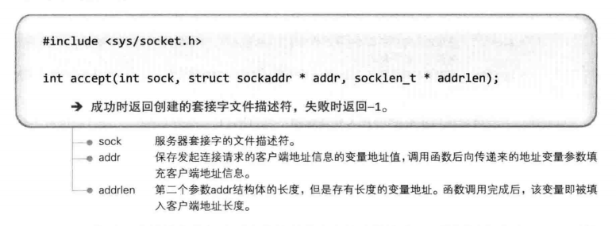

##简化四层OSI：##

## 服务端socket流程: ##

## listen函数: ##

## accept函数: ##

## 客户端socket流程: ##

## connect函数: ##

## 客户端服务端协同流程: ##

## 迭代服务器: ##

## TCP的IO缓冲: ##

还记得缓冲分几种么：全缓冲，行缓冲，无缓冲

TCP中不会因为数据溢出而丢失数据，因为又滑动窗口(Sliding Window)协议，套接字会相互沟通缓冲。

## TCP连接过程: ##

三次握手(Three-way handshaking)：
首先，套接字是全双工的。其次，连接时发的SEQ与ACK分别为：
SEQ：
> sequence number：表示的是我方（发送方）这边，这个packet的数据部分的第一位应该在整个data stream中所在的位置。（注意这里使用的是“应该”。因为对于没有数据的传输，如ACK，虽然它有一个seq，但是这次传输在整个data stream中是不占位置的。所以下一个实际有数据的传输，会依旧从上一次发送ACK的数据包的seq开始）
> seq：client端第一次发送packet，即：first-way handshake。所以按照上面的准则，它的数据应该从第一个开始，也即是第0位开始，所以seq为0。
> seq：server端第一次发送packet，即：second-way handshake。所以，这个packet的seq为0。
> seq：third-way handshake。上一次发送时为【1】，【1】中seq为0且为SYN数据包，所以这一次的seq为1（0增加1）。

ACK：
> acknowledge number：表示的是期望的对方（接收方）的下一次sequence number是多少。
注意，SYN/FIN的传输虽然没有data，但是会让下一次传输的packet seq增加一，但是，ACK的传输，不会让下一次的传输packet加一。
> ack：而server端之前并未发送过数据，所以期望的是server端回传时的packet的seq应该从第一个开始，即是第0位开始，所以ack为0。
> ack：由于在【1】中接收到的是client端的SYN数据包，且它的seq为1，所以client端会让它自己的seq增加1。由此可预计（expect），client端的下一次packet传输时，它的seq是1（0增加1）。所以，ACK为1。
> ack：上次接收到时为【2】，【2】中seq为0，且为SYN数据包（虽然在flag上同时设定为SYN/ACK，但只要flag是SYN，就会驱使seq加一），所以可预计，server端下一次seq为1（0增加1）。

参考：[https://www.jianshu.com/p/15754b4e9458](参考)

发送流程是：SYN-SYN+ACK-ACK
 
##TCP传输过程: ##

此时ack为1301而非1201是因为ack号的增量为传输的数据字节数。

**ACK号=SEQ号+传递字节数+1**
超时后会重传的。

 ## TCP断开连接过程: ## 

断开过程为4次握手(Four-way handshaking)。

一共2次传递ACK 5001，但第二次FIN数据包中的ACK 5001是因为接收ACK消息后未接收数据而重传的。